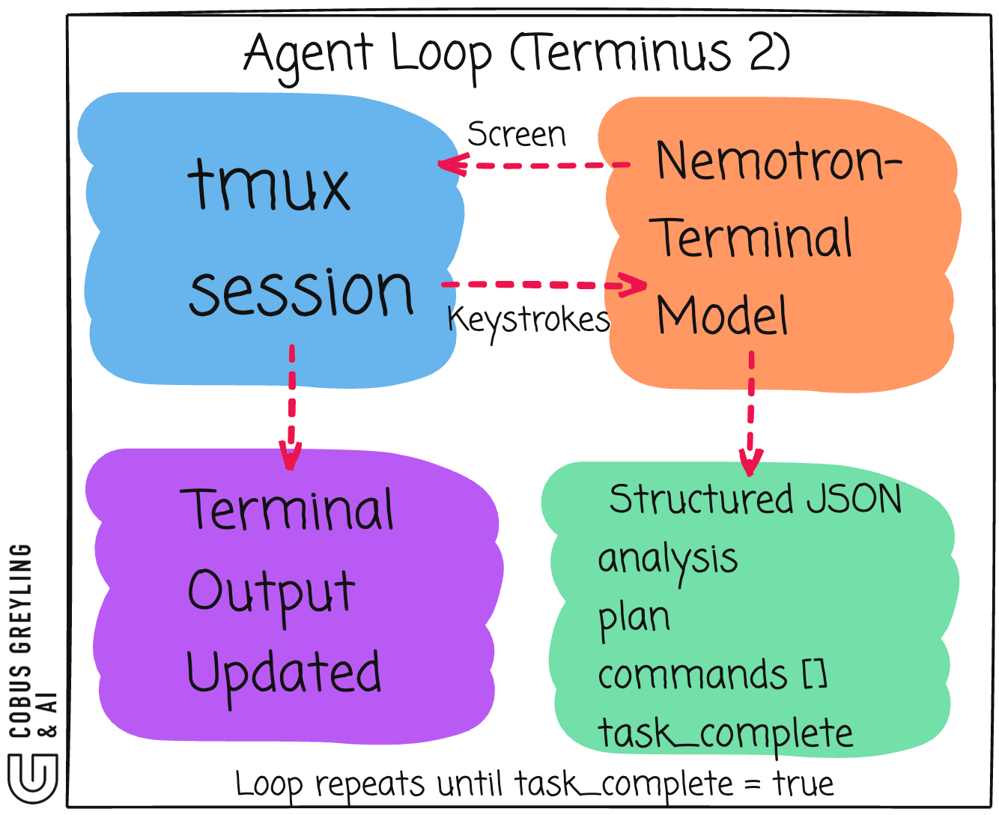
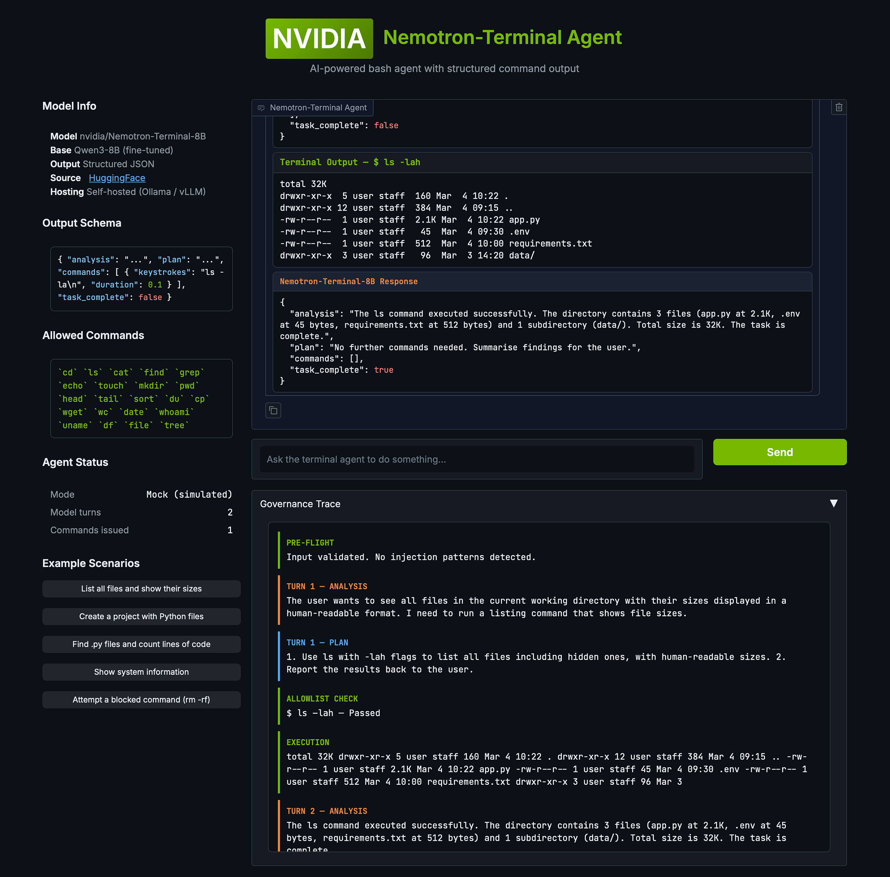

# NVIDIA Nemotron-Terminal

**NVIDIA's Nemotron-Terminal takes a contrarian approach to AI Agents**


---

## In Short

Instead of building more elaborate agent frameworks, they invested in making the base model better at **terminal interaction**.

The scaffolding stays minimal.

The model does the heavy lifting.

The **Nemotron-Terminal family (8B, 14B, 32B)** is fine-tuned from Qwen3, purpose-built for *autonomous CLI interaction.*

> The terminal is not just a tool, it is the universal interface to compute.

Not chat.

Not code generation.

Terminal autonomy.

Every model response is structured JSON with four fields:

- **Analysis**, what the model sees on screen (via the Terminus 2 light framework)
- **Plan**, step-by-step reasoning about what to do next
- **Commands**, raw keystrokes to send to the terminal
- **task_complete**, boolean flag signalling the job is done

The model never touches the terminal itself.

It is a prediction engine only.

> The approach inverts the typical agent design pattern.

As I mentioned, NVIDIA's Terminus 2 scaffolding closes the loop.

A minimal orchestration layer that captures screen state, feeds it to the model, parses the JSON, sends keystrokes, waits, then repeats.

> The real contribution is data engineering.

NVIDIA said it directly in the paper, "*rather than exploring variants in agentic design, we focus on scaling underlying model capabilities through targeted supervised fine-tuning*."

---

## CLI as the path to AI Autonomy

NVIDIA's bet with Nemotron-Terminal is refreshingly contrarian.

Rather than building more elaborate agent frameworks, they invested in making the base model better at terminal interaction.

The scaffolding stays minimal, the model does the heavy lifting.

I find this approach compelling.

---

## What Nemotron-Terminal actually is

**Nemotron-Terminal** is a family of models (8B, 14B, 32B) fine-tuned from **Qwen3**, purpose-built for autonomous terminal interaction.

Not chat. Not code generation. **Terminal autonomy.**

The model reads raw terminal screen state as input via the Terminus 2 framework.

So the model does not literally *see* the screen.

It reads text.

Terminus 2 runs the terminal session inside `tmux`. After each command executes, the scaffolding captures the `tmux` pane content as a plain text string, the raw characters currently displayed in the terminal window. That text dump gets passed to the model as its next input.

It outputs structured JSON, not free-form text, not tool calls. Every response follows a fixed schema with four fields.

```json
{
  "analysis": "...",
  "plan": "...",
  "commands": [
    {
      "keystrokes": "ls -la\n",
      "duration": 0.1
    }
  ],
  "task_complete": false
}
```

The **analysis** field is the model's reading of the current terminal state before acting. Again, I say model, but it is not the model per se, but via the light framework.

The **plan** is explicit reasoning about what to do next.

The **commands** array contains raw keystrokes (including `\n` for Enter).

The **task_complete** boolean signals when the job is done.

One detail worth highlighting, the model operates at the **keystroke level**, not the command level.

It can interact with interactive programs like `vim`, `top`, or `ssh` sessions. Not just one-shot shell commands.

---

## The model is a prediction engine only

Nemotron-Terminal never touches the terminal itself. It takes in screen state, outputs JSON with proposed keystrokes, then stops. Without an orchestration layer, the JSON just sits there.

You need something to close the loop.



The model is stateless between turns. All context comes from what it sees on screen.

---

## Terminus 2 is the scaffolding layer

NVIDIA's reference implementation for the orchestration loop is called Terminus 2.

It is deliberately minimal, a model-agnostic agent that provides an interactive `tmux` session running inside a sandboxed Docker container.

No specialised tools. No elaborate pipelines. Just a `tmux` session, a model, and structured JSON in between.

Terminus 2 sends model-determined keystrokes to the `tmux` session, giving the agent flexibility to use any available command-line tools.

The `duration` values in the command objects tell Terminus 2 how long to wait before capturing the next screen state.

---

## Gradio Demo



I built a [Nemotron-Terminal Agent demo](https://github.com/cobusgreyling/cli-path-to-autonomy) in Gradio that visualises the full agent loop. It shows the structured JSON output, command execution blocks, governance allowlisting, and a step-by-step audit trace for every interaction.

---

## Self-hosted only

There is no NIM API endpoint for Nemotron-Terminal. The models live on [HuggingFace](https://huggingface.co/collections/nvidia/nemotron-terminal) and must be run locally via Ollama, vLLM or llama.cpp.

---

## Finally

NVIDIA is making a deliberate architectural statement with Nemotron-Terminal.

The terminal is not just a tool, it is the universal interface to compute.

A model that can autonomously operate a terminal session can install software, configure systems, debug issues, deploy applications.

The approach inverts the typical agent design pattern.

Instead of building smarter frameworks around general-purpose models, build a smarter model around a minimal framework.

Terminus 2 is intentionally thin because the intelligence belongs in the weights, not the wiring.

I expect to see more of this pattern. As foundation models absorb capabilities that previously required tooling, the framework layer will continue to compress.

> **As foundation models absorb capabilities that previously required tooling, the framework layer will continue to compress.**
> **Intelligence belongs in the weights, not the wiring.**

---

## References

- [On Data Engineering for Scaling LLM Terminal Capabilities](https://arxiv.org/abs/2602.21193)
- [Nemotron-Terminal Collection](https://huggingface.co/collections/nvidia/nemotron-terminal)
- [Gradio Demo — cli-path-to-autonomy](https://github.com/cobusgreyling/cli-path-to-autonomy)

---

*Chief Evangelist @ Kore.ai | Passionate about exploring the intersection of AI and language. Language Models, AI Agents, Agentic Apps, Dev Frameworks & Data-Driven Tools shaping tomorrow.*
